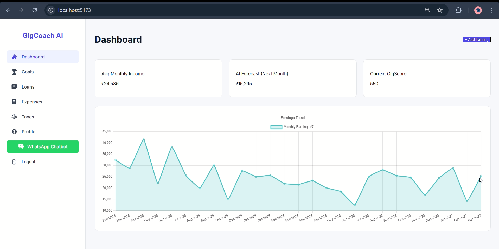
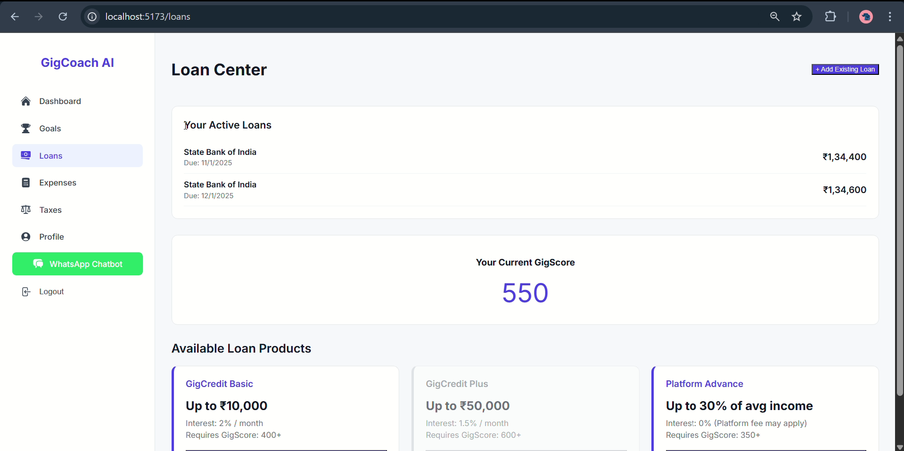
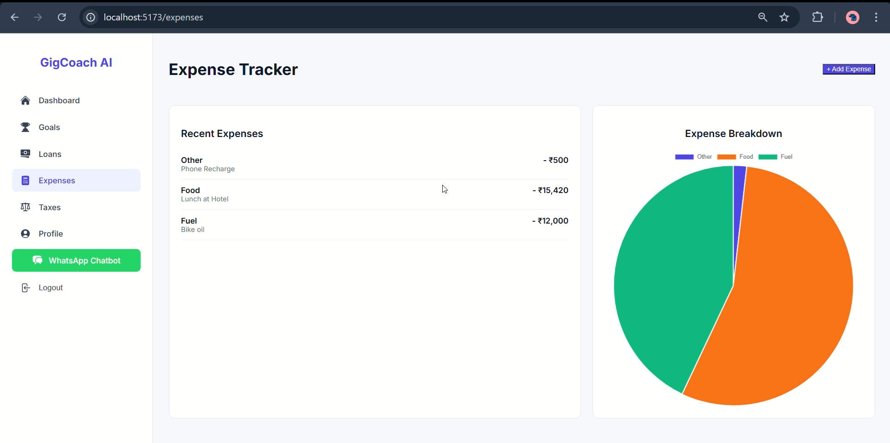
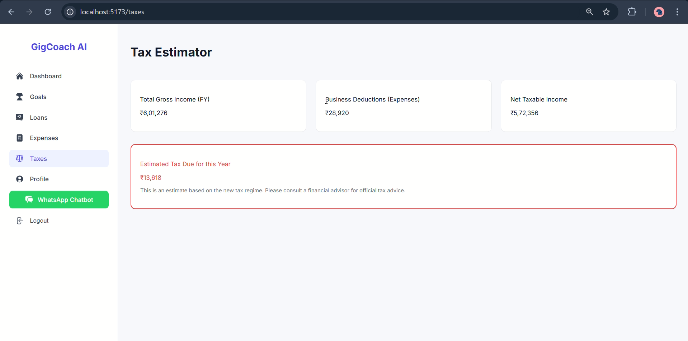

# 🚀 GigCoach AI: The Financial Co-Pilot for Gig Workers

**A full-stack financial wellness platform designed to be the "financial nervous system" for India's gig economy workers, featuring a web dashboard and a companion WhatsApp bot.**

<p align="center">
  
  
  
</p>

<p align="center">
  
  
  
</p>


---

### Problem Statement
Millions of gig economy workers in India face extreme income volatility, making financial planning nearly impossible. This leads to a cycle of debt, an inability to save for goals, and exclusion from traditional financial products. GigCoach AI was built to solve this critical problem.

### Our Solution
GigCoach AI is not just another app; it's a proactive financial coach that integrates seamlessly into a gig worker's life. It analyzes their unique earning patterns to provide:
- **Clarity:** A clear view of their financial health.
- **Foresight:** AI-powered predictions to help them prepare for slow months.
- **Guidance:** Actionable insights to improve their financial stability and build credit.

---

### ✨ Key Features

* **Multi-User Authentication:** Secure OTP-based login system.
* **Dynamic Dashboard:** Real-time visualization of earnings, trends, and AI-powered insights.
* **Interactive Goal Setting:** Users can create, update, delete, and track progress on their financial goals.
* **Expense Tracking:** A dedicated module to log and categorize business expenses with a visual breakdown.
* **Dynamic GigScore:** A proprietary credit score calculated from the user's earnings history and stability.
* **Personalized Loan Options:** Displays loan product eligibility based on the user's live GigScore.
* **AI Coach Insights:** Proactive, personalized tips generated by analyzing the user's data.
* **Companion WhatsApp Bot:** Core features are accessible via a simple and familiar chat interface.

---

### 💻 Tech Stack

* **Frontend:** React.js, Vite, React Router, Axios, Chart.js
* **Backend:** Node.js, Express.js
* **Database:** PostgreSQL
* **WhatsApp Integration:** Twilio API
* **Authentication:** JWT (JSON Web Tokens) & Passwordless OTP

---

### Local Setup

1.  Clone the repository.
2.  Run `npm install`.
3.  Create a `.env` file and add `VITE_API_BASE_URL=http://localhost:3000`.
4.  Run `npm run dev`.

---

### 🔗 Backend Repository
The backend server and API code for this project can be found here:
**[https://github.com/YourUsername/gigcoach-ai](https://github.com/Ayushkr-iitm/gigcoach-ai)** ```
